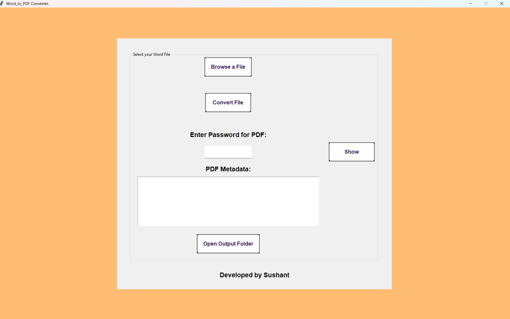
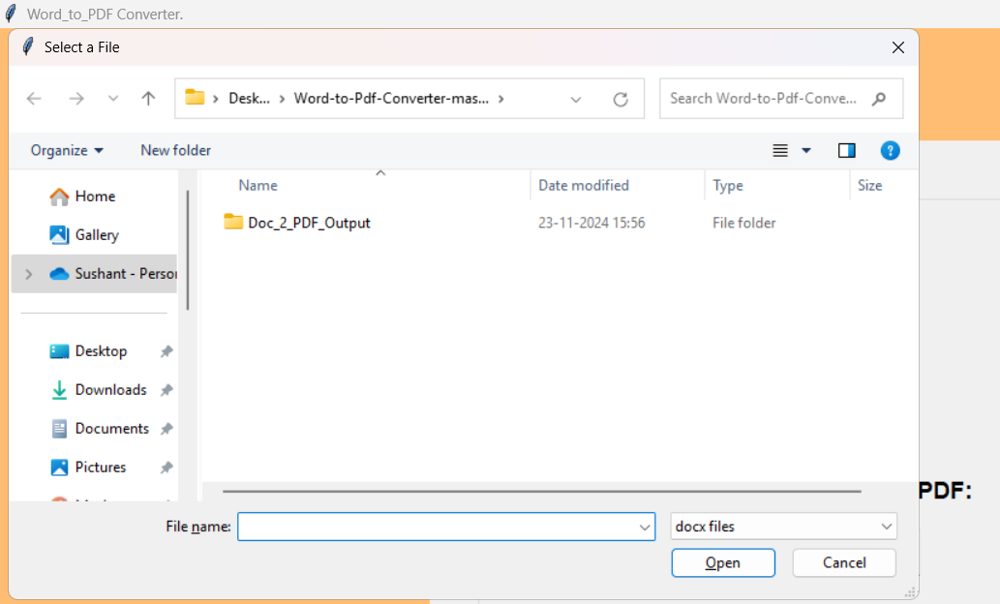
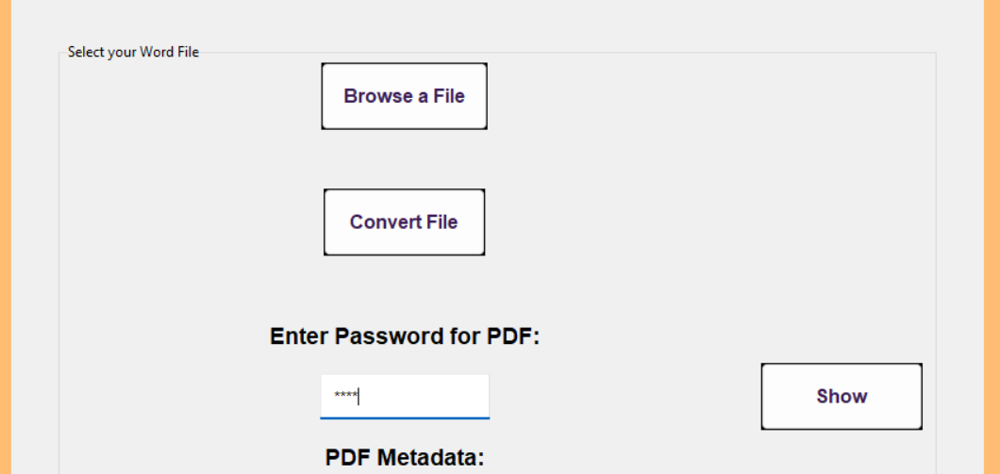
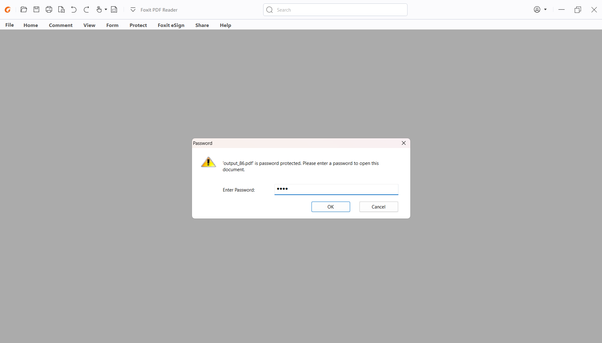
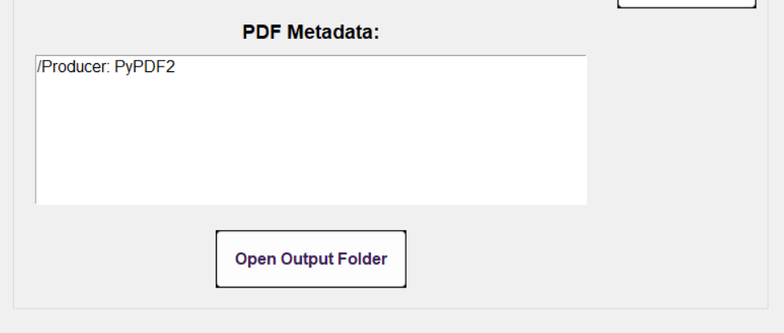
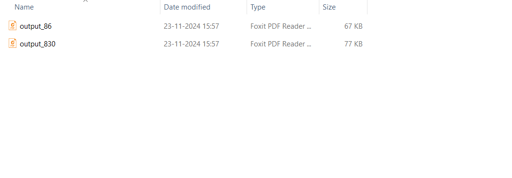

# Word to PDF Converter

This is a GUI-based application built in Python that converts Microsoft Word (`.docx`) files to PDF format. It also supports setting passwords for the PDFs and viewing their metadata. The application is cross-platform and designed to provide a user-friendly interface.

---

## Features

- **File Selection**: Browse and select `.docx` files for conversion.
- **Password Protection**: Set a password to encrypt the generated PDF.
- **Metadata Viewer**: Display metadata of the converted PDF, such as title, author, etc.
- **Output Management**: Converted files are saved to a dedicated folder, and the folder can be opened directly from the app.
- **Responsive Design**: Works in fullscreen mode across platforms (Windows, Linux, macOS).

---

## Requirements

- Python 3.8 or higher
- Dependencies:
  - `docx2pdf` 
  - `tkinter`
  - `PyPDF2`

Install dependencies using `pip`:

```bash
pip install docx2pdf PyPDF2
```

**Usage**
1. Running the Application

2. Save the script to a .py file (e.g., word_to_pdf_converter.py).

**Run the script using Python:**

```bash
Copy code
python word_to_pdf_converter.py
```

**Interface Overview**

1. Browse a File: Select the .docx file you want to convert.
2. Enter Password for PDF: Optional. Enter a password to encrypt the PDF.
3. Convert File: Convert the selected Word file to PDF.
4. Open Output Folder: Open the folder containing the converted PDFs.
5. PDF Metadata: View metadata of the generated PDF in the app.

**Author** 

Developed by Sushant.

Feel free to contribute, report bugs, or suggest features!

### 4. Save the File

- Save the file (`File > Save` or `Ctrl+S`/`Cmd+S`).

### ScreenShots

**Interface**



**Browse a File**



**Enter Password**



**Authenticate Password**




**Metadata**



**Output Folder**



**Result**


